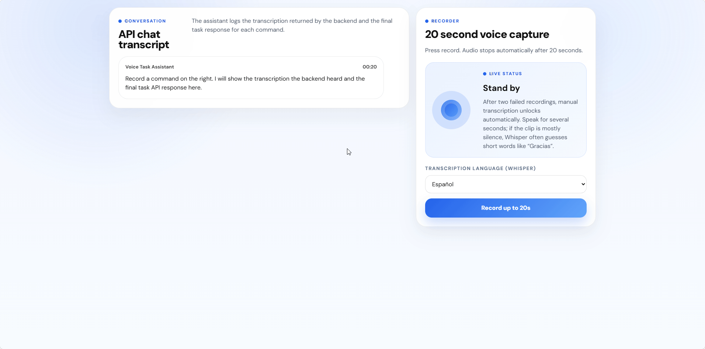

# Voice Command API — Habla con tu lista de tareas

API en FastAPI para gestionar una lista de tareas **con la voz**. El navegador graba una orden como *"Añade comprar leche a mi lista"*. El backend la transcribe con **Whisper**, usa un **LLM** para decidir qué operación de la API corresponde, la ejecuta sobre la lista de tareas y devuelve el resultado.

```text
"Marca comprar leche como completada"  →  PATCH /tasks/1 {"done": true}  →  {"id": 1, "title": "Comprar leche", "done": true}
```

La intención la decide siempre el modelo de lenguaje. No hay reglas manuales del tipo `if "añade" in texto`.

## Demo

Grabación del flujo completo con el frontend de 4Geeks y el micrófono real (idioma: español). Se ve cómo se graba la orden de voz, la transcripción que devuelve el backend y la acción ejecutada sobre la lista de tareas.



**[Ver el vídeo en calidad completa (MP4, 25 MB)](docs/demo/demo-voice-command-api.mp4)**

El registro detallado de todas las pruebas está en [PRUEBAS.md](PRUEBAS.md).

## Tecnologías

- **Python 3.11+** (probado con 3.14) y **uv** para gestionar dependencias.
- **FastAPI** y **Uvicorn** para la API HTTP.
- **Pydantic** y **pydantic-settings** para validar datos y leer la configuración desde `.env`.
- **Groq**, con el mismo cliente y la misma API key para:
  - `whisper-large-v3-turbo`: transcripción de audio a texto;
  - `openai/gpt-oss-20b`: conversión del texto en una instrucción JSON.
- **pytest** para las pruebas automáticas.

## Instalación

Requisitos: Python 3.11 o superior, [uv](https://docs.astral.sh/uv/), Node.js 20.19 o superior (para el frontend) y una cuenta gratuita en [Groq](https://console.groq.com).

```bash
git clone https://github.com/rubenlosada11/voice-command-api.git
cd voice-command-api
uv sync
```

`uv sync` crea el entorno virtual `.venv` e instala las versiones exactas fijadas en `uv.lock`, incluido pytest. Si quieres activar el entorno a mano:

```powershell
.venv\Scripts\Activate.ps1      # Windows (PowerShell)
```

```bash
source .venv/bin/activate       # macOS / Linux
```

## Variables de entorno

### Backend: `.env` en la raíz

```bash
cp .env.example .env            # PowerShell: Copy-Item .env.example .env
```

Edita `.env` y pon tu clave de Groq, que se crea en *console.groq.com → API Keys*:

```text
GROQ_API_KEY=tu_clave_de_groq
GROQ_MODEL=openai/gpt-oss-20b
GROQ_TRANSCRIPTION_MODEL=whisper-large-v3-turbo
REQUEST_TIMEOUT_SECONDS=45
ALLOWED_ORIGINS=http://localhost:5173,http://127.0.0.1:5173
```

| Variable | Obligatoria | Descripción |
|---|---|---|
| `GROQ_API_KEY` | Sí | Clave de Groq. La API no arranca sin ella. |
| `GROQ_MODEL` | No | Modelo que convierte la orden en una instrucción. |
| `GROQ_TRANSCRIPTION_MODEL` | No | Modelo de Whisper para la transcripción. |
| `REQUEST_TIMEOUT_SECONDS` | No | Tiempo máximo de espera de cada llamada a Groq. |
| `ALLOWED_ORIGINS` | No | Orígenes permitidos por CORS, separados por comas. |

`.env` está en `.gitignore`. **La clave nunca debe subirse al repositorio.**

### Frontend: `frontend/.env`

```bash
cp frontend/.env.example frontend/.env   # PowerShell: Copy-Item frontend\.env.example frontend\.env
```

Contiene `VITE_API_BASE_URL=http://127.0.0.1:8000`, la dirección del backend.

## Ejecución

Necesitas dos terminales.

**Terminal 1, backend** (en la raíz del proyecto):

```bash
uv run uvicorn src.main:app --reload
```

- API: http://127.0.0.1:8000
- Documentación interactiva: http://127.0.0.1:8000/docs

**Terminal 2, frontend:**

```bash
cd frontend
npm ci
npm run dev
```

Abre http://localhost:5173, elige el idioma, pulsa **Record** y concede permiso al micrófono.

**Pruebas automáticas:**

```bash
uv run pytest
```

Las pruebas sustituyen Groq por un doble de pruebas: no hacen llamadas reales ni necesitan una clave válida.

## Endpoints

| Método | Ruta | Descripción | Respuesta correcta |
|---|---|---|---|
| `GET` | `/tasks` | Lista todas las tareas | 200 |
| `POST` | `/tasks` | Crea una tarea (`title` obligatorio, `done` opcional) | 201 |
| `PUT` | `/tasks/{task_id}` | Reemplaza una tarea (`title` y `done` obligatorios) | 200 |
| `PATCH` | `/tasks/{task_id}` | Modifica `title` y/o `done` | 200 |
| `DELETE` | `/tasks/{task_id}` | Elimina una tarea | 200 |
| `POST` | `/instruction` | Convierte un texto en una instrucción **sin ejecutarla** | 200 |
| `POST` | `/transcribe` | Audio o texto → instrucción → **la ejecuta** | 200 |
| `GET` | `/` | Comprobación de estado (`{"status": "ok"}`) | 200 |

### Errores

| Código | Cuándo |
|---|---|
| 400 | Falta el archivo de audio, está vacío o el idioma no es válido |
| 404 | La tarea no existe, también cuando la orden de voz menciona una tarea que no está en la lista |
| 413 | El audio supera los 25 MB |
| 415 | `Content-Type` o formato de audio no admitido en `/transcribe` |
| 422 | Cuerpo inválido: falta `title`, está vacío, tipos incorrectos o no se detectó voz en el audio |
| 502 | Groq no responde o el modelo devuelve una instrucción no válida |

## Ejemplos

Los ejemplos están sacados de pruebas reales. Tienes todas en [PRUEBAS.md](PRUEBAS.md).

### CRUD

```http
POST /tasks
{"title": "Comprar leche"}
```

```json
201 {"id": 1, "title": "Comprar leche", "done": false}
```

```http
PATCH /tasks/1
{"done": true}
```

```json
200 {"id": 1, "title": "Comprar leche", "done": true}
```

```http
DELETE /tasks/1
```

```json
200 {"message": "Task 1 deleted"}
```

### `POST /instruction`: solo devuelve la instrucción

```http
POST /instruction
{"transcription": "marca comprar leche como completada"}
```

```json
200 {"endpoint": "/tasks/1", "method": "PATCH", "params": {"done": true}}
```

La lista de tareas **no cambia**. Este endpoint solo indica qué habría que hacer.

### `POST /transcribe`: audio (lo que envía el frontend)

`multipart/form-data` con los campos `file` (webm, ogg, m4a, mp4, wav, mp3, mpeg, mpga o flac) y `language` (opcional, código ISO 639-1 como `es`; si se omite, Whisper detecta el idioma).

```json
200 {
  "transcription": "Añade comprar leche a mi lista.",
  "instruction": {"endpoint": "/tasks", "method": "POST", "params": {"title": "Comprar leche"}},
  "result": {"id": 1, "title": "Comprar leche", "done": false}
}
```

### `POST /transcribe`: texto (modo manual del frontend)

Si la grabación falla dos veces, el frontend permite escribir la orden. En ese caso envía JSON y se omite Whisper:

```http
POST /transcribe
{"transcription": "elimina comprar leche"}
```

```json
200 {
  "transcription": "elimina comprar leche",
  "instruction": {"endpoint": "/tasks/3", "method": "DELETE", "params": {}},
  "result": {"message": "Task 3 deleted"}
}
```

## Arquitectura

```text
src/
├── main.py                        # Punto de entrada: uvicorn src.main:app
└── app/
    ├── main.py                    # Crea la app, CORS y traducción de errores a HTTP
    ├── core/config.py             # Configuración leída de .env
    ├── schemas/voice.py           # Modelos Pydantic de entrada y salida
    ├── utils/language.py          # Normaliza el idioma para Whisper
    ├── api/routes/                # Solo HTTP: validan la entrada y llaman a los servicios
    │   ├── tasks.py               #   CRUD /tasks
    │   ├── instruction.py         #   POST /instruction
    │   └── transcribe.py          #   POST /transcribe y GET /
    └── services/                  # Lógica de la aplicación
        ├── task_store.py          #   Lista `tasks` en memoria y operaciones CRUD
        ├── groq_client.py         #   Cliente de Groq compartido
        ├── speech_to_text.py      #   Audio → texto (Whisper)
        ├── instruction_resolver.py#   Texto → instrucción JSON validada (LLM)
        └── instruction_executor.py#   Ejecuta la instrucción sobre task_store
tests/                             # Pruebas con pytest
frontend/                          # Frontend proporcionado por 4Geeks
```

### Almacenamiento en memoria

Las tareas se guardan en una lista de Python (`tasks`) dentro del proceso: `{"id": 1, "title": "Comprar leche", "done": false}`.

- **No hay base de datos ni archivos.** Las tareas se pierden al reiniciar el servidor.
- Los IDs salen de un contador independiente. Un ID borrado **no se reutiliza** mientras el servidor siga en marcha.

### Flujo de `POST /transcribe`

```text
Navegador (MediaRecorder, máx. 20 s)
  │  multipart: file + language        ── o JSON {transcription} en modo manual
  ▼
routes/transcribe.py      valida el formato, el tamaño y el idioma
  ▼
speech_to_text            Groq Whisper → texto          (se omite en modo manual)
  ▼
instruction_resolver      la misma función que POST /instruction:
                          envía al LLM la orden y la lista actual de tareas (con sus IDs),
                          en modo JSON, y valida la respuesta:
                          · JSON con exactamente endpoint, method y params
                          · method ∈ GET, POST, PUT, PATCH, DELETE
                          · endpoint = /tasks o /tasks/{id numérico}
                          · GET/POST solo sobre /tasks; PUT/PATCH/DELETE solo sobre /tasks/{id}
  ▼
instruction_executor      valida params con los mismos modelos que el CRUD
                          y llama a la misma función de task_store
  ▼
{transcription, instruction, result}  →  frontend
```

Como el modelo recibe la lista actual de tareas, puede resolver una orden como *"marca comprar leche como completada"* con el ID real de la tarea. Si la tarea mencionada no existe, el modelo usa el id `0` y la API responde **404**.

Cada orden se traduce en **una sola** operación. En una orden compuesta como *"crea A, B y C"* solo se ejecuta la primera acción.

## Frontend

El frontend (`frontend/`, en TypeScript con Vite) lo proporciona [4Geeks Academy](https://4geeksacademy.com/) como parte del ejercicio. **No forma parte de esta implementación y no se ha modificado.** El backend se ha adaptado a su contrato: solo llama a `POST /transcribe` y espera `{transcription, instruction, result}`.

## Pruebas

- **Automáticas:** `uv run pytest` ejecuta el almacén en memoria, el CRUD, CORS, `/instruction` y `/transcribe`.
- **Manuales y reales:** con Groq, con audio y con el navegador. Detalladas en [PRUEBAS.md](PRUEBAS.md).
